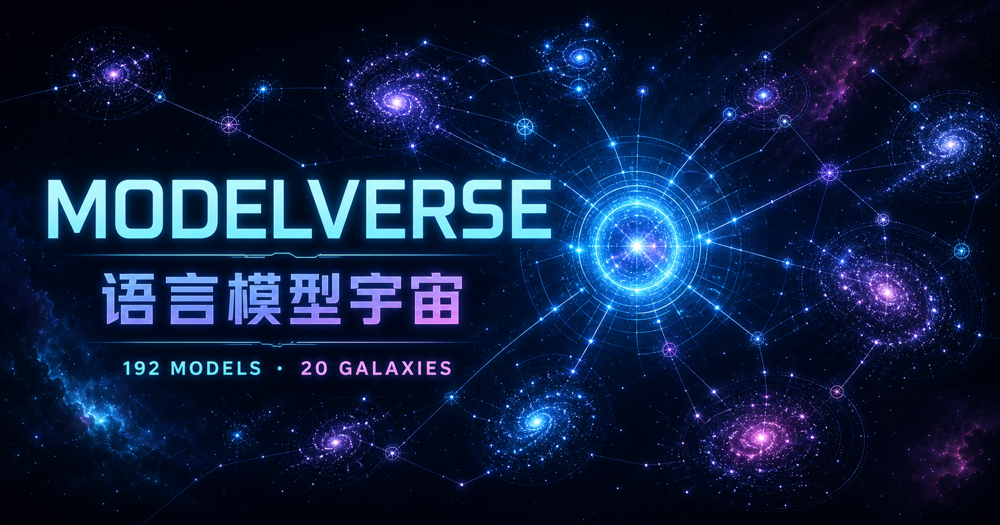

# MODELVERSE · 模型宇宙

<p align="center">
  
</p>

<p align="center"><strong>Don’t browse AI models. Navigate their universe.</strong></p>

<p align="center">
  <a href="https://modelverse.tech">Live Universe</a> ·
  <a href="#中文">中文</a> ·
  <a href="#english">English</a>
</p>



## 中文

MODELVERSE 是一个面向开发者与企业的 AI 模型生态可视化导航系统。它把模型公司变成恒星，把模型变成沿不同轨道运行的行星，让原本散落在参数表、排行榜和发布公告中的信息，成为一个可以探索、比较和持续追踪的宇宙。

它不只是“有哪些模型”的百科，更希望回答一个真正重要的问题：**哪个模型更适合你？**

### 你可以做什么

- 在可旋转、缩放的模型宇宙中发现公司与模型
- 按模型类型、研发国家或地区、公司与使用场景筛选
- 用自然语言搜索“便宜的代码模型”“适合中文客服”或“可以本地部署”
- 查看模型简介、优势、限制、上下文、价格、协议与部署方式
- 对比多个候选模型，辅助技术选型和采购决策
- 使用首页“部署计算器”，快速估算主流模型的显存与 GPU 容量需求
- 探索 Agent 产品与模型之间的生态关系
- 在中英文界面及桌面、移动设备间获得一致体验

### 本地部署选型计算器

首页内置了轻量的本地部署选型计算器，目前精选 16 款主流、具有公开参数且适合进行本地部署容量估算的模型，覆盖 DeepSeek、Qwen、Kimi、GLM、MiniMax、GPT‑OSS、Llama、Mistral、Nemotron 与 Seed‑OSS 等模型家族。

你可以调整：

- 权重精度：BF16、FP8／INT8 或 INT4
- 实际上下文长度与峰值并发
- KV Cache 精度
- vLLM、TGI 等推理框架开销
- GPU 型号与单卡可用显存容量

计算器会分别展示模型权重、KV Cache、框架开销、总显存需求、工程建议 GPU 卡数、最大并发、服务器节点、并行策略与网络建议。展开“私有化部署与云 API 成本分析”后，还可以比较硬件投入、月度本地成本、月度云端成本、盈亏平衡点和预计回本周期。结果用于架构前期讨论，不替代推理框架实测、硬件兼容性验证与正式 POC。

### 宇宙规则

- **公司是恒星**：Logo 位于系统中心，代表模型研发组织
- **模型是行星**：旗舰、主流、轻量、专项与历史模型拥有不同轨道和亮度
- **距离表达重要性**：越核心、越主流的模型越靠近公司恒星
- **运动表达生命力**：模型系统持续运行，像技术生态一样不断演化

## English

MODELVERSE is a visual navigation and decision platform for the AI model ecosystem. Companies become stars; their models become planets moving across distinct orbits. What was once scattered across spec sheets, leaderboards, pricing pages, and launch posts becomes a universe you can explore.

It is not only an encyclopedia of what exists. It is designed to answer a more useful question: **which model fits your needs?**

### Highlights

- High-performance Canvas universe with rotation, zoom, touch, and pinch gestures
- Bilingual Chinese and English product experience
- Natural-language, alias-aware, typo-tolerant model discovery
- Company-centered planetary systems and lifecycle-aware model hierarchy
- Structured model profiles focused on suitability before raw specifications
- Multi-model comparison workspace for technical and business decisions
- Homepage deployment calculator for rapid VRAM and GPU capacity estimates
- Dedicated Agent ecosystem navigation
- Responsive desktop and mobile interfaces with ambient nebula visuals and sound

### Local deployment calculator

The homepage includes a focused deployment sizing calculator with 16 mainstream models whose public parameter counts support meaningful local-inference estimates. The shortlist spans DeepSeek, Qwen, Kimi, GLM, MiniMax, GPT‑OSS, Llama, Mistral, Nemotron, and Seed‑OSS families.

Adjust weight precision, working context, peak concurrency, KV-cache precision, inference-framework overhead, and per-GPU usable memory. The calculator breaks the estimate into model weights, KV cache, total VRAM, practical GPU count, concurrency ceiling, node topology, parallel strategy, and network guidance. An expandable economics section compares private deployment with cloud APIs, including hardware investment, monthly cost, break-even volume, and estimated payback.

Results are early architecture estimates—not a substitute for inference-framework benchmarks, hardware compatibility validation, or a production POC.

## Run locally

Requires Node.js 22.13 or newer and pnpm.

```bash
pnpm install
pnpm dev
```

Open the local URL shown in the terminal.

## Production build

```bash
pnpm build
pnpm start
```

## Catalog pipeline

Curated records in `data/curated-models.json` have the highest priority. Public catalogs are then merged, normalized, deduplicated, and screened to remove aliases, quantized copies, adapters, and model merges.

```bash
pnpm catalog:update
```

The generated catalog is written to `public/models.json`, with an audit summary in `data/catalog-report.json`. Trusted organizations and source rules live in `data/source-registry.json`.

## Technology

- React 19 + TypeScript
- Vinext + Vite
- Canvas-based interactive visualization
- Responsive pointer, wheel, touch, and pinch interaction
- Alibaba Cloud Linux + Nginx deployment templates

## Project status

MODELVERSE is evolving from a visual model atlas into a decision platform for discovering, comparing, evaluating, and continuously tracking AI models.

Live at **[modelverse.tech](https://modelverse.tech)**.
